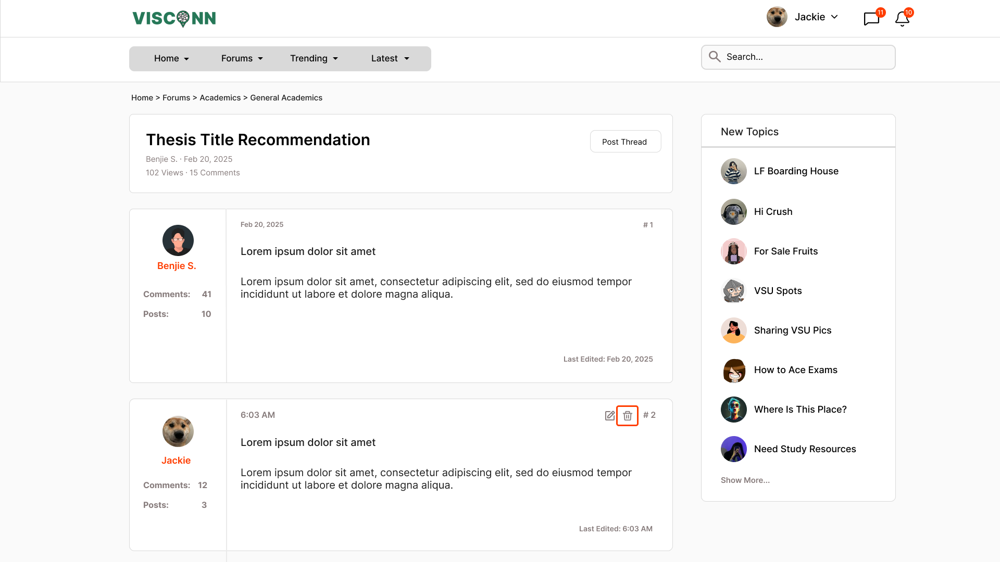
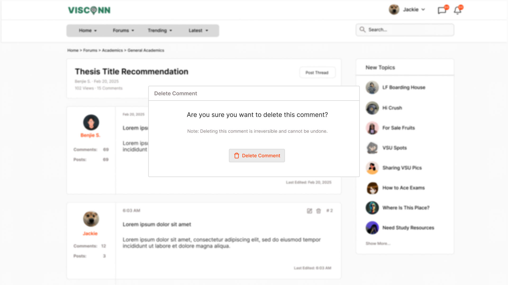

<h2>Purple-eclipse</h2>

<strong>Target:</strong> `PE.010.006`

<table border="1" cellpadding="0" cellspacing="0" style="width: 80%; font-size: 12px;">
    <tr style="width: 70%;">
        <td valign="top">
            <h3 style="margin-top:0">Revisions</h3>
            <h4 style="list-style-type: none; padding-left: 0;">Site Map</h4>
            
 Main page, Authentication, and Account Creation 

            <a href="../homepage">Main Page</a>
            <ul style="list-style-type: none ; padding-left: 0">
                <li style="padding-left: 15px"> <a href="../homepage/homepage.md"> Home Page </a></li>  
            </ul>
            <a href="/authenticate-user">Authentication</a>
            <ul>
                <li><a href="../authenticate-user/account-signup.md">Sign up</a></li>
                <li><a href="../authenticate-user/account-login.md">Account Login</a></li>
            </ul>
             
 Forum Management 

            <a href="../manage-forum">Manage Forum</a>
            <ul>
                <li><a href="../manage-forum/add-forum.md">Add forum</a></li>
                <li><a href="../manage-forum/add-subforum.md">Add subforum</a></li>
                <li><a href="../manage-forum/delete-forum.md">Delete forum</a></li>
                <li><a href="../manage-forum/delete-subforum.md">Delete subforum</a></li>
                <li><a href="../manage-forum/edit-forum.md">Edit forum</a></li>
                <li><a href="../manage-forum/edit-subforum.md">Edit subforum</a></li>
            </ul>
            <a href="../manage-thread">Manage Thread</a>
            <ul>
                <li><a href="../manage-thread/delete-thread.md">Delete thread</a></li>
                <li><a href="../manage-thread/edit-thread.md">Edit thread</a></li>
                <li><a href="../manage-thread/manage-thread.md">Manage thread</a></li>
                <li><a href="../manage-thread/view-thread.md">View thread</a></li>
            </ul>
            
 Forum and subforum browsing and joining, Multimedia Content Sharing

            <a href="/manage-comment">Manage Comment</a>
            <ul>
                <li><a href="delete-comment.md">Delete comment</a></li>
                <li><a href="edit-comment.md">Edit comment</a></li>
                <li><a href="post-comment.md">Post comment</a></li>
            </ul>
            
 Notification System 

            <a href="../manage-notification">Notification</a>
            <ul style="list-style-type: none ; padding-left: 0">
                <li style="padding-left: 15px"> <a href="../manage-notification/recieve-notification.md">Recieve notification </a></li>
                <li style="padding-left: 15px"> <a href="../manage-notification/delete-notification.md"> Delete comment </a></li>    
            </ul>
            
 Search Feature 
 
            <a href="../search-functionality">Search Functionality</a>
            <ul style="list-style-type: none ; padding-left: 0">
                <li style="padding-left: 15px"> <a href="../search-functionality/search-thread.md"> Search Thread </a></li>
                <li style="padding-left: 15px"> <a href="../search-functionality/search-user.md"> Search User </a></li>
            </ul>
            <h4> In-App Message </h4>
            <a href="../manage-message">Real-Time Messaging</a>
            <ul style="list-style-type: none ; padding-left: 0">
                <li style="padding-left: 15px"> <a href="../manage-message/send-message.md"> Send message </a></li>
                <li style="padding-left: 15px"> <a href="../manage-message/receive-message.md"> Receive message </a></li>
            </ul>
        </td>
        <td valign="top" style="width: 30%;">
            <a href="https://github.com/Davidty143/purple-eclipse/blob/main/docs/homepage/homepage.md">Homepage</a> &gt;
            <a href="https://github.com/Davidty143/purple-eclipse/tree/main/docs/manage-comment">Delete Comment</a>
              
            
            
            <h2>Delete Comment</h2>
            
The "Delete Comment" feature allows authorized users, such as the comment poster or admins,
              to permanently remove comments from a thread. Admins have the ability to delete any comment for moderation,
              while users can only delete their own. 

            <h2>Use Case Scenario</h2>
            <table border="1">
                <tr>
                    <td colspan="2" align="left">
                      User Comment on Thread
                    </td>
                </tr>
                <tr>
                    <th>Actor(s)</th>
                    <td>User, Admin</td>
                </tr>
              <tr>
                <th>Goal</th>
                <td>Permanently remove a comment from a thread.</td>
              </tr>  
                <tr>
                    <th>Precondtions</th>
                    <td>
                          The user must be logged in to their account. 
                          The user must have previously posted the comment they wish to edit. 
                          The admin can delete any comment for moderation.
                    </td>
                </tr>
                <tr>
                    <th>Main Scenario</th>
                    <td>
                        1. The user navigates to the comment they want to delete.
                         
                        2. The user clicks the "Trash" icon next to the "Edit" icon associated with their comment.
                         
                        3. If the user is an admin, they can delete any comment in the thread.
                           
                        4. A confirmation prompt appears to prevent accidental deletion.
                         
                        5. The user confirms the deletion.
                         
                        6.	The comment is permanently removed from the thread.
                    </td>
                </tr>
                <tr>
                    <th>Outcome: </th>
                    <td>The comment is deleted and no longer visible in the thread.</td>
                </tr>
            </table>   
          <tr>
              <td colspan="2" align="center">
                  © Tenza
              </td>
          </tr>
</table>
