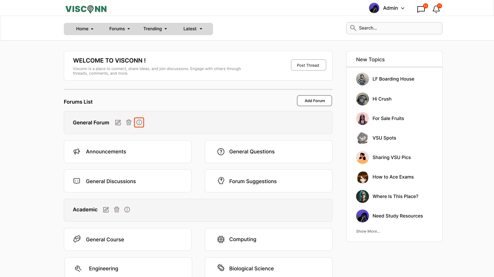
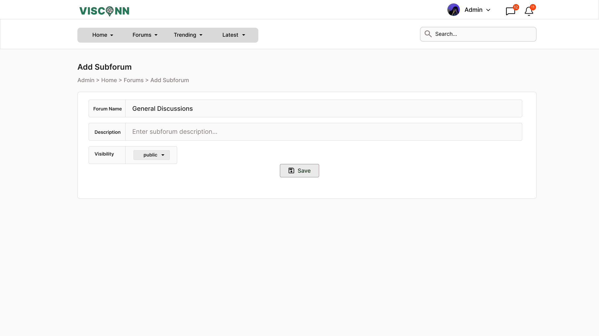

<h2>Purple-eclipse</h2>

<strong>Target:</strong> `AB.0XY.00Z`

<table border="1" cellpadding="0" cellspacing="0" style="width: 80%; font-size: 12px;">
    <tr style="width: 70%;">
        <td>
            <h3>Revisions</h3>
            <h4 style="list-style-type: none; padding-left: 0;">Site Map</h4>
 <a href="../homepage/homepage.md">Homepage</a>
             
            <a href="../authenticate-user/account-signup.md">Authentication</a>
            <ul>
                <li><a href="../authenticate-user/account-signup.md">Sign up</a></li>
                <li><a href="../authenticate-user/account-login.md">Account Login</a></li>
            </ul>
            <a href="delete-comment.md">Forum Management</a>
            <ul>
                <li><a href="../manage-comment/delete-comment.md">Delete comment dialog</a></li>
                <li><a href="../manage-comment/edit-comment.md">Edit comment dialog</a></li>
                <li><a href="../manage-comment/post-comment.md">Post comment dialog</a></li>
            </ul>
            <a href="add-forum.md">Discussion Creation/Participation</a>
            <ul>
                <li><a href="add-forum.md">Add forum dialog</a></li>
                <li><a href="add-subforum.md">Add subforum dialog</a></li>
                <li><a href="delete-forum.md">Delete forum dialog</a></li>
                <li><a href="delete-subforum.md">Delete subforum dialog</a></li>
                <li><a href="edit-forum.md">Edit forum dialog</a></li>
                <li><a href="edit-subforum.md">Edit subforum dialog</a></li>
            </ul>
            <a href="../manage-notification/receive-notification.md">Notification</a>
            <ul>
                <li><a href="../manage-notification/receive-notification.md">Receive notification dialog</a></li>
            </ul>
            <a href="../manage-thread/delete-thread.md">Multimedia Content Sharing</a>
            <ul>
                <li><a href="../manage-thread/delete-thread.md">Delete thread dialog</a></li>
                <li><a href="../manage-thread/edit-thread.md">Edit thread dialog</a></li>
                <li><a href="../manage-thread/manage-thread.md">Manage thread dialog</a></li>
                <li><a href="../manage-thread/view-thread.md">View thread dialog</a></li>
            </ul>
            <a href="">Search Functionality</a>
              
            <a href="../manage-message/receive-message.md">Real-Time Messaging</a>
            <ul>
                <li><a href="../manage-message/receive-message.md">Receive message</a></li>
                <li><a href="../manage-message/send-message.md">Send message</a></li>
            </ul>
        </td>
        <td valign="top" style="width: 30%;">
            <a href="https://github.com/Davidty143/purple-eclipse/blob/main/docs/homepage/homepage.md">Homepage</a> &gt;
            <a href="https://github.com/Davidty143/purple-eclipse/tree/main/docs/manage-forum">Add Subforum</a>
              
            
            
            <h2>Add Subforum</h2>
            
The "Add Subforum" functionality enables administrators to create new subforums within existing forums, 
              specifying details like name, description and its visibility settings.
            

            <h2>Use Case Scenario</h2>
            <table border="1">
                <tr>
                    <td colspan="2" align="left">
                      User Create Forum
                    </td>
                </tr>
                <tr>
                    <th>Actor(s)</th>
                    <td>Admin</td>
                </tr>
              <tr>
                <th>Goal</th>
                <td>Add a new subforum under an existing forum.</td>
              </tr>  
                <tr>
                    <th>Precondtions</th>
                    <td>
                          The user must be logged in as an admin. 
                          The forum where the subforum will be added must already exist. 
                          The admin must be on the forums page.
                    </td>
                </tr>
                <tr>
                    <th>Main Scenario</th>
                    <td>
                        1. The administrator clicks the "Create Subforum" button from the forum page.
                         
                        2. The system displays a form to enter the subforum name, description,  and any other required settings, such as visibility.
                         
                        3. The admin enters the necessary information and submits the form.
                           
                        4. The system validates the input and creates the forum.
                         
                        5. The new subforum is successfully added and appears in the forum's list.
                                     
                    </td>
                </tr>
                <tr>
                    <th>Outcome: </th>
                    <td>
                      A new subforum is created and visible under the appropriate forum. The administrator  can manage the subforum's content and settings.
                    </td>
                </tr>
            </table>   
          <tr>
              <td colspan="2" align="center">
                  © Tenza
              </td>
          </tr>
</table>
