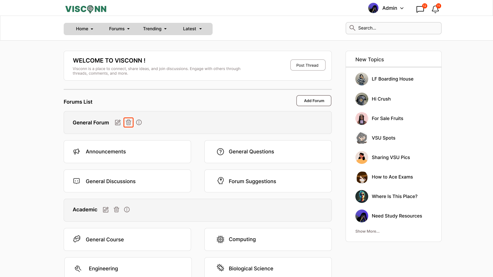
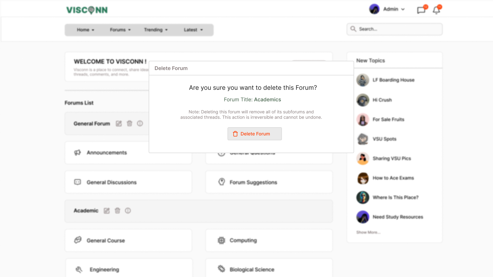

<h2>Purple-eclipse</h2>

<strong>Target:</strong> `PE.010.006`

<table border="1" cellpadding="0" cellspacing="0" style="width: 80%; font-size: 12px;">
    <tr style="width: 70%;">
        <td valign="top">
            <h3 style="margin-top:0">Revisions</h3>
            <h4 style="list-style-type: none; padding-left: 0;">Site Map</h4>
            
 Main page, Authentication, and Account Creation 

            <a href="../homepage">Main Page</a>
            <ul style="list-style-type: none ; padding-left: 0">
                <li style="padding-left: 15px"> <a href="../homepage/homepage.md"> Home Page </a></li>  
            </ul>
            <a href="/authenticate-user">Authentication</a>
            <ul>
                <li><a href="../authenticate-user/account-signup.md">Sign up</a></li>
                <li><a href="../authenticate-user/account-login.md">Account Login</a></li>
            </ul>
             
 Forum Management 

            <a href="/manage-forum">Manage Forum</a>
            <ul>
                <li><a href=add-forum.md">Add forum</a></li>
                <li><a href="add-subforum.md">Add subforum</a></li>
                <li><a href="delete-forum.md">Delete forum</a></li>
                <li><a href="delete-subforum.md">Delete subforum</a></li>
                <li><a href="edit-forum.md">Edit forum</a></li>
                <li><a href="edit-subforum.md">Edit subforum</a></li>
                <li><a href="edit-subforum.md">View forum</a></li>
                <li><a href="edit-subforum.md">View subforum</a></li>
            </ul>
            <a href="../manage-thread">Manage Thread</a>
            <ul>
                <li><a href="../manage-thread/delete-thread.md">Delete thread</a></li>
                <li><a href="../manage-thread/edit-thread.md">Edit thread</a></li>
                <li><a href="../manage-thread/manage-thread.md">Manage thread</a></li>
                <li><a href="../manage-thread/view-thread.md">View thread</a></li>
            </ul>
            
 Forum and subforum browsing and joining, Multimedia Content Sharing

            <a href="/manage-comment">Manage Comment</a>
            <ul>
                <li><a href="../manage-comment/delete-comment.md">Delete comment</a></li>
                <li><a href="../manage-comment/edit-comment.md">Edit comment</a></li>
                <li><a href="../manage-comment/post-comment.md">Post comment</a></li>
            </ul>
            
 Notification System 

            <a href="../manage-notification">Notification</a>
            <ul style="list-style-type: none ; padding-left: 0">
                <li style="padding-left: 15px"> <a href="../manage-notification/recieve-notification.md">Recieve notification </a></li>
                <li style="padding-left: 15px"> <a href="../manage-notification/delete-notification.md"> Delete comment </a></li>    
            </ul>
            
 Search Feature 
 
            <a href="../search-functionality">Search Functionality</a>
            <ul style="list-style-type: none ; padding-left: 0">
                <li style="padding-left: 15px"> <a href="../search-functionality/search-thread.md"> Search Thread </a></li>
                <li style="padding-left: 15px"> <a href="../search-functionality/search-user.md"> Search User </a></li>
            </ul>
            <h4> In-App Message </h4>
            <a href="../manage-message">Real-Time Messaging</a>
            <ul style="list-style-type: none ; padding-left: 0">
                <li style="padding-left: 15px"> <a href="../manage-message/send-message.md"> Send message </a></li>
                <li style="padding-left: 15px"> <a href="../manage-message/receive-message.md"> Receive message </a></li>
            </ul>
        </td>
        <td valign="top" style="width: 30%;">
            <a href="https://github.com/Davidty143/purple-eclipse/blob/main/docs/homepage/homepage.md">Homepage</a> &gt;
            <a href="https://github.com/Davidty143/purple-eclipse/tree/main/docs/manage-forum">Delete Forum</a>
              
             
            
            <h2>Delete Forum</h2>
            
The "Delete Forum" functionality allows the administrator to remove forums and all their related content. This action is irreversible and ensures that forums no longer appear in the platform.

            <h2>Use Case Scenario</h2>
            <table border="1">
                <tr>
                    <td colspan="2" align="left">
                      User delete on Forum
                    </td>
                </tr>
                <tr>
                    <th>Actor(s)</th>
                    <td>Admin</td>
                </tr>
              <tr>
                <th>Goal</th>
                <td>Deletes an existing forum from the platform.</td>
              </tr>  
                <tr>
                    <th>Precondtions</th>
                    <td>
                          The user must be logged in as an admin. 
                          The forum to be deleted must exist. 
                          The admin is in the forum’s page.    
                    </td>
                </tr>
                <tr>
                    <th>Main Scenario</th>
                    <td>
                        1. The administrator selects the forum they wish to delete. 
                        2. The system prompts for confirmation to prevent accidental deletion. 
                        3. The admin confirms the deletion. 
                        4. The forum and all associated subforums and threads are archived and are removed from the page.
                    </td>
                </tr>
                <tr>
                    <th>Outcome </th>
                    <td>The forum and its associated content such as the subforums and threads  are removed from the platform and are no longer accessible by the users.</td>
                </tr>
            </table>   
          <tr>
              <td colspan="2" align="center">
                  © Tenza
              </td>
          </tr>
</table>

