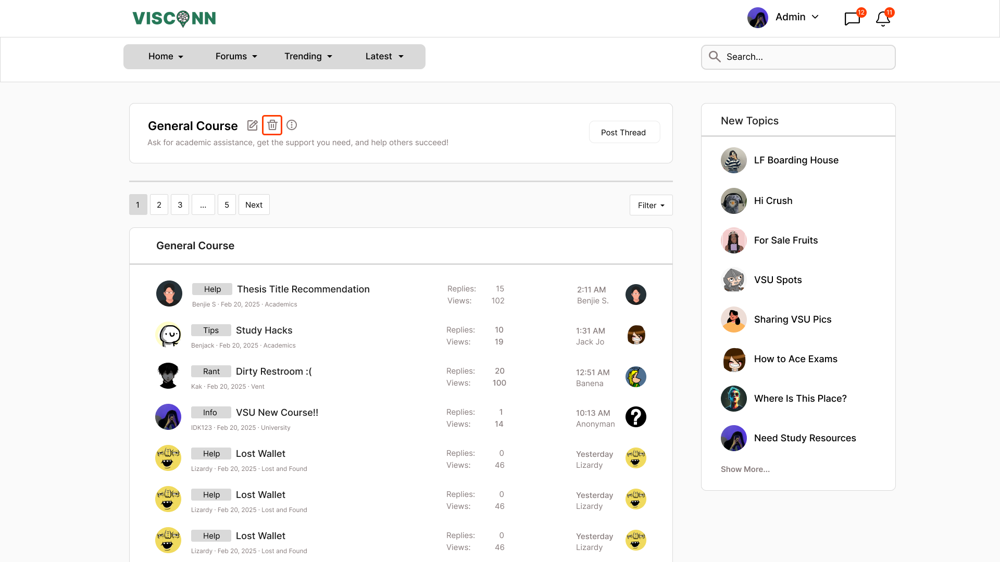
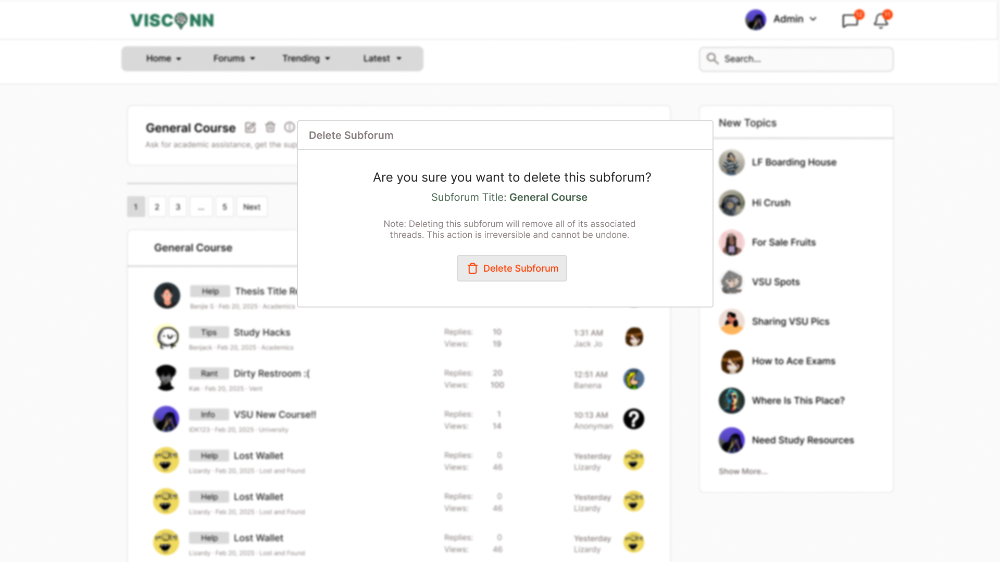

<h2>Purple-eclipse</h2>

<strong>Target:</strong> `AB.0XY.00Z`

<table border="1" cellpadding="0" cellspacing="0" style="width: 80%; font-size: 12px;">
    <tr style="width: 70%;">
        <td>
            <h3>Revisions</h3>
            <h4 style="list-style-type: none; padding-left: 0;">Site Map</h4>
             <a href="../homepage/homepage.md">Homepage</a>
             
            <a href="../authenticate-user/account-signup.md">Authentication</a>
            <ul>
                <li><a href="../authenticate-user/account-signup.md">Sign up</a></li>
                <li><a href="../authenticate-user/account-login.md">Account Login</a></li>
            </ul>
            <a href="delete-comment.md">Forum Management</a>
            <ul>
                <li><a href="../manage-comment/delete-comment.md">Delete comment dialog</a></li>
                <li><a href="../manage-comment/edit-comment.md">Edit comment dialog</a></li>
                <li><a href="../manage-comment/post-comment.md">Post comment dialog</a></li>
            </ul>
            <a href="add-forum.md">Discussion Creation/Participation</a>
            <ul>
                <li><a href="add-forum.md">Add forum dialog</a></li>
                <li><a href="add-subforum.md">Add subforum dialog</a></li>
                <li><a href="delete-forum.md">Delete forum dialog</a></li>
                <li><a href="delete-subforum.md">Delete subforum dialog</a></li>
                <li><a href="edit-forum.md">Edit forum dialog</a></li>
                <li><a href="edit-subforum.md">Edit subforum dialog</a></li>
            </ul>
            <a href="../manage-notification/receive-notification.md">Notification</a>
            <ul>
                <li><a href="../manage-notification/receive-notification.md">Receive notification dialog</a></li>
            </ul>
            <a href="../manage-thread/delete-thread.md">Multimedia Content Sharing</a>
            <ul>
                <li><a href="../manage-thread/delete-thread.md">Delete thread dialog</a></li>
                <li><a href="../manage-thread/edit-thread.md">Edit thread dialog</a></li>
                <li><a href="../manage-thread/manage-thread.md">Manage thread dialog</a></li>
                <li><a href="../manage-thread/view-thread.md">View thread dialog</a></li>
            </ul>
            <a href="">Search Functionality</a>
              
            <a href="../manage-message/receive-message.md">Real-Time Messaging</a>
            <ul>
                <li><a href="../manage-message/receive-message.md">Receive message</a></li>
                <li><a href="../manage-message/send-message.md">Send message</a></li>
            </ul>
        </td>
        <td valign="top" style="width: 30%;">
            <a href="https://github.com/Davidty143/purple-eclipse/blob/main/docs/homepage/homepage.md">Homepage</a> &gt;
            <a href="https://github.com/Davidty143/purple-eclipse/tree/main/docs/manage-forum">Delete Subforum</a>
              
            
            
            <h2>Delete  Subforum</h2>
            

              The "Delete Subforum" functionality allows administrators to permanently remove subforums along with their associated threads and content. 
              Once deleted, the subforum and its contents cannot be accessed by the users.
            

            <h2>Use Case Scenario</h2>
            <table border="1">
                <tr>
                    <td colspan="2" align="left">
                      Admin Create Subforum
                    </td>
                </tr>
                <tr>
                    <th>Actor(s)</th>
                    <td>Admin</td>
                </tr>
              <tr>
                <th>Goal</th>
                <td>Delete a subforum from the platform.</td>
              </tr>  
                <tr>
                    <th>Precondtions</th>
                    <td>
                          The user must be logged in as an admin. 
                          The subforum to be deleted exists. 
                          The admin must be on the selected subforum page.
                    </td>
                </tr>
                <tr>
                    <th>Main Scenario</th>
                    <td>
                        1. The administrator clicks the "Trash" icon button beside the “Edit Subforum”  button from the selected subforum’s page.
                         
                        2. The system prompts for confirmation to prevent accidental deletion.
                         
                        3. The admin confirms the deletion.
                           
                        4. The subforum and all associated threads and comments are archived and  are removed from the page.       
                    </td>
                </tr>
                <tr>
                    <th>Outcome: </th>
                    <td>
                       The selected subforum is deleted from the platform, and all associated content is removed.
                    </td>
                </tr>
            </table>   
          <tr>
              <td colspan="2" align="center">
                  © Tenza
              </td>
          </tr>
</table>
