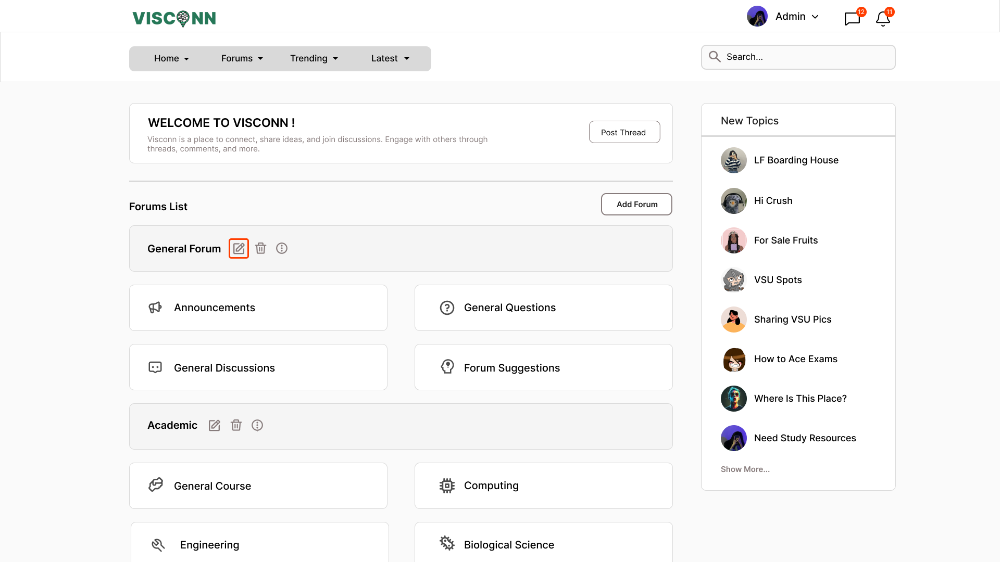
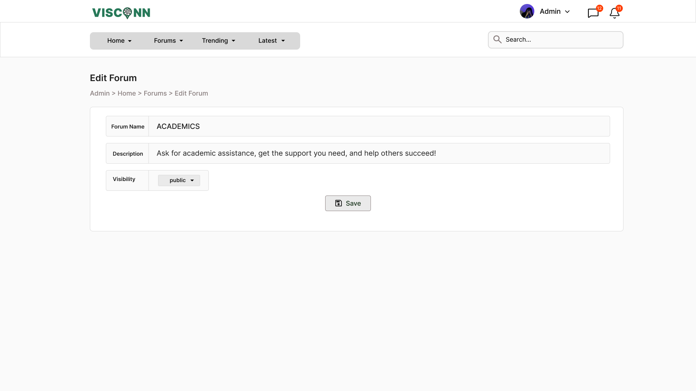

<h2>Purple-eclipse</h2>

<strong>Target:</strong> `PE.010.006`

<table border="1" cellpadding="0" cellspacing="0" style="width: 80%; font-size: 12px;">
    <tr style="width: 70%;">
        <td valign="top">
            <h3 style="margin-top:0">Revisions</h3>
            <h4 style="list-style-type: none; padding-left: 0;">Site Map</h4>
            
 Main page, Authentication, and Account Creation 

            <a href="../homepage">Main Page</a>
            <ul style="list-style-type: none ; padding-left: 0">
                <li style="padding-left: 15px"> <a href="../homepage/homepage.md"> Home Page </a></li>  
            </ul>
            <a href="/authenticate-user">Authentication</a>
            <ul>
                <li><a href="../authenticate-user/account-signup.md">Sign up</a></li>
                <li><a href="../authenticate-user/account-login.md">Account Login</a></li>
            </ul>
             
 Forum Management 

            <a href="/manage-forum">Manage Forum</a>
            <ul>
                <li><a href=add-forum.md">Add forum</a></li>
                <li><a href="add-subforum.md">Add subforum</a></li>
                <li><a href="delete-forum.md">Delete forum</a></li>
                <li><a href="delete-subforum.md">Delete subforum</a></li>
                <li><a href="edit-forum.md">Edit forum</a></li>
                <li><a href="edit-subforum.md">Edit subforum</a></li>
                <li><a href="edit-subforum.md">View forum</a></li>
                <li><a href="edit-subforum.md">View subforum</a></li>
            </ul>
            <a href="../manage-thread">Manage Thread</a>
            <ul>
                <li><a href="../manage-thread/delete-thread.md">Delete thread</a></li>
                <li><a href="../manage-thread/edit-thread.md">Edit thread</a></li>
                <li><a href="../manage-thread/manage-thread.md">Manage thread</a></li>
                <li><a href="../manage-thread/view-thread.md">View thread</a></li>
            </ul>
            
 Forum and subforum browsing and joining, Multimedia Content Sharing

            <a href="/manage-comment">Manage Comment</a>
            <ul>
                <li><a href="../manage-comment/delete-comment.md">Delete comment</a></li>
                <li><a href="../manage-comment/edit-comment.md">Edit comment</a></li>
                <li><a href="../manage-comment/post-comment.md">Post comment</a></li>
            </ul>
            
 Notification System 

            <a href="../manage-notification">Notification</a>
            <ul style="list-style-type: none ; padding-left: 0">
                <li style="padding-left: 15px"> <a href="../manage-notification/recieve-notification.md">Recieve notification </a></li>
                <li style="padding-left: 15px"> <a href="../manage-notification/delete-notification.md"> Delete comment </a></li>    
            </ul>
            
 Search Feature 
 
            <a href="../search-functionality">Search Functionality</a>
            <ul style="list-style-type: none ; padding-left: 0">
                <li style="padding-left: 15px"> <a href="../search-functionality/search-thread.md"> Search Thread </a></li>
                <li style="padding-left: 15px"> <a href="../search-functionality/search-user.md"> Search User </a></li>
            </ul>
            <h4> In-App Message </h4>
            <a href="../manage-message">Real-Time Messaging</a>
            <ul style="list-style-type: none ; padding-left: 0">
                <li style="padding-left: 15px"> <a href="../manage-message/send-message.md"> Send message </a></li>
                <li style="padding-left: 15px"> <a href="../manage-message/receive-message.md"> Receive message </a></li>
            </ul>
        </td>
        <td valign="top" style="width: 30%;">
            <a href="https://github.com/Davidty143/purple-eclipse/blob/main/docs/homepage/homepage.md">Homepage</a> &gt;
            <a href="https://github.com/Davidty143/purple-eclipse/tree/main/docs/manage-forum">Edit Forum</a>
              
            
             
            <h2>Edit Forum</h2>
            
The "Edit Forum" functionality enables administrators to modify existing forums. Any changes are immediately reflected on the platform. 

            <h2>Use Case Scenario</h2>
            <table border="1">
                <tr>
                    <td colspan="2" align="left">
                      User Edit on Forum
                    </td>
                </tr>
                <tr>
                    <th>Actor(s)</th>
                    <td>Admin</td>
                </tr>
              <tr>
                <th>Goal</th>
                <td>Update or modify an existing forum's details such as name, description, and settings.</td>
              </tr>  
                <tr>
                    <th>Precondtions</th>
                    <td>
                          The user must be logged in as an admin. 
                          The forum to be edited must already exist. 
                          The admin is in the forum’s page
                    </td>
                </tr>
                <tr>
                    <th>Main Scenario</th>
                    <td>
                        1. The administrator clicks on the "Edit" option next to the selected forum.
                         
                        2. The system displays a form with the current details of the forum.
                         
                        3. The admin modifies the required fields such as the forum name, description, or settings
                           
                        4. The admin clicks the "Save" or button.
                         
                        5. The forum is now updated with the new details.
                         
                    </td>
                </tr>
                <tr>
                    <th>Outcome: </th>
                    <td>The forum is successfully updated, and changes are reflected on the platform.</td>
                </tr>
            </table>   
          <tr>
              <td colspan="2" align="center">
                  © Tenza
              </td>
          </tr>
</table>
