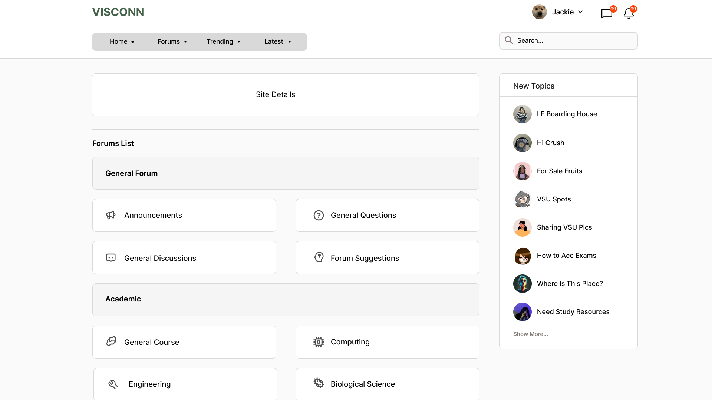

<h2>Purple-eclipse</h2>

<strong>Target:</strong> `PE.020.002`

<table border="1" cellpadding="0" cellspacing="0" style="width: 80%; font-size: 12px;">
    <tr style="width: 70%;">
        <td valign="top">
            <h3 style="margin-top:0">Revisions</h3>
            <h4 style="list-style-type: none; padding-left: 0;">Site Map</h4>
            
 Main page, Authentication, and Account Creation 

            <a href="../homepage">Main Page</a>
            <ul style="list-style-type: none ; padding-left: 0">
                <li style="padding-left: 15px"> <a href="../homepage/homepage.md"> Home Page </a></li>  
            </ul>
            <a href="/authenticate-user">Authentication</a>
            <ul>
                <li><a href="../authenticate-user/account-signup.md">Sign up</a></li>
                <li><a href="../authenticate-user/account-login.md">Account Login</a></li>
            </ul>
             
 Forum Management 

            <a href="/manage-forum">Manage Forum</a>
            <ul>
                <li><a href=add-forum.md">Add forum</a></li>
                <li><a href="add-subforum.md">Add subforum</a></li>
                <li><a href="delete-forum.md">Delete forum</a></li>
                <li><a href="delete-subforum.md">Delete subforum</a></li>
                <li><a href="edit-forum.md">Edit forum</a></li>
                <li><a href="edit-subforum.md">Edit subforum</a></li>
                <li><a href="view-forum.md">View forum</a></li>
                <li><a href="view-subforum.md">View subforum</a></li>
            </ul>
            <a href="../manage-thread">Manage Thread</a>
            <ul>
                <li><a href="../manage-thread/delete-thread.md">Delete thread</a></li>
                <li><a href="../manage-thread/edit-thread.md">Edit thread</a></li>
                <li><a href="../manage-thread/manage-thread.md">Manage thread</a></li>
                <li><a href="../manage-thread/view-thread.md">View thread</a></li>
            </ul>
            
 Forum and subforum browsing and joining, Multimedia Content Sharing

            <a href="/manage-comment">Manage Comment</a>
            <ul>
                <li><a href="../manage-comment/delete-comment.md">Delete comment</a></li>
                <li><a href="../manage-comment/edit-comment.md">Edit comment</a></li>
                <li><a href="../manage-comment/post-comment.md">Post comment</a></li>
            </ul>
            
 Notification System 

            <a href="../manage-notification">Notification</a>
            <ul style="list-style-type: none ; padding-left: 0">
                <li style="padding-left: 15px"> <a href="../manage-notification/recieve-notification.md">Recieve notification </a></li>
                <li style="padding-left: 15px"> <a href="../manage-notification/delete-notification.md"> Delete comment </a></li>    
            </ul>
            
 Search Feature 
 
            <a href="../search-functionality">Search Functionality</a>
            <ul style="list-style-type: none ; padding-left: 0">
                <li style="padding-left: 15px"> <a href="../search-functionality/search-thread.md"> Search Thread </a></li>
                <li style="padding-left: 15px"> <a href="../search-functionality/search-user.md"> Search User </a></li>
            </ul>
            
 Manage Profile

            <a href="../manage-profile">Profile</a>
            <ul>
                <li><a href="../manage-profile/edit-profile.md">Edit Profile</a></li>
                <li><a href="../manage-profile/view-profile.md">View Profile</a></li>
            </ul>
            <h4> In-App Message </h4>
            <a href="../manage-message">Real-Time Messaging</a>
            <ul style="list-style-type: none ; padding-left: 0">
                <li style="padding-left: 15px"> <a href="../manage-message/send-message.md"> Send message </a></li>
                <li style="padding-left: 15px"> <a href="../manage-message/receive-message.md"> Receive message </a></li>
            </ul>
            
 Manage User 

            <a href="../manage-user">Manage User</a>
            <ul style="list-style-type: none ; padding-left: 0">
                <li style="padding-left: 15px"> <a href="../manage-user/ban-user.md"> Ban User </a></li>
                <li style="padding-left: 15px"> <a href="../manage-user/restrict-user.md"> Restrict User </a></li>
            </ul>
        </td>
        <td valign="top" style="width: 30%;">
            <a href="https://github.com/Davidty143/purple-eclipse/blob/main/docs/homepage/homepage.md">Homepage</a> &gt;
            <a href="https://github.com/Davidty143/purple-eclipse/tree/main/docs/view-forum">View Forum</a>
              
            <h3> Forum View </h3>
            
            <h2>View Forum</h2>
            
The "View Forum" feature allows users to access and explore forum content, including all available subforums in each categorized forum.

            <h2>Use Case Scenario</h2>
            <table border="1">
                <tr>
                    <td colspan="2" align="left">
                      User Views Forum
                    </td>
                </tr>
                <tr>
                    <th>Actor(s)</th>
                    <td>User, Admin, Guest</td>
                </tr>
                <tr>
                    <th>Goal</th>
                    <td>View a forum to explore subforums within a specific forum.</td>
                </tr>  
                <tr>
                    <th>Preconditions</th>
                    <td>
                          The user is logged in or a guest. 
                          The user is in the forum’s page. 
                          The forum exists and is accessible based on user permissions.
                    </td>
                </tr>
                <tr>
                    <th>Main Scenario</th>
                    <td>
                        1. The system loads the forum's content, which is name, its description, and the list of subforums under its category. 
                        2. The user can browse through the forum’s subforums. 
                        3. The admin has additional capabilities to add and manage forum content.
                    </td>
                </tr>
                <tr>
                    <th>Outcome:</th>
                    <td>The forum content is displayed to the user, with proper navigation and available actions based on the user's role.</td>
                </tr>
            </table>   
          <tr>
              <td colspan="2" align="center">
                  © Tenza
              </td>
          </tr>
</table>
