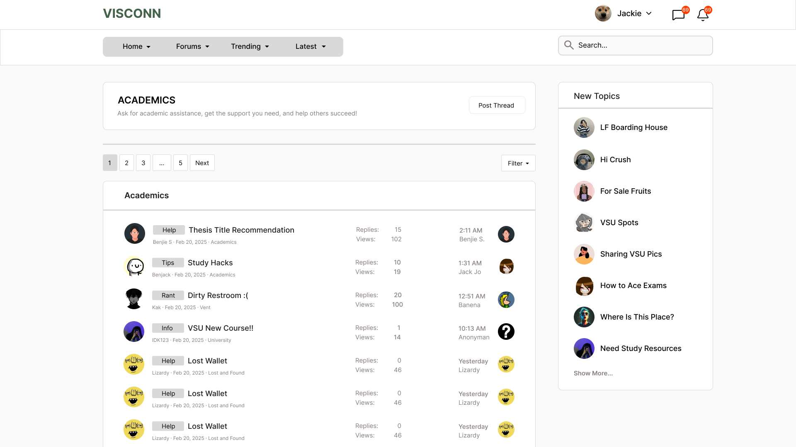

<h2>View Subforum</h2>

<strong>Target:</strong> `AB.0XY.00Z`

<table border="1" cellpadding="0" cellspacing="0" style="width: 80%; font-size: 12px;">
    <tr style="width: 70%;" valign="top">
        <td width="18%">
            <h3>Revisions</h3>
            <h4 style="list-style-type: none; padding-left: 0;">Site Map</h4>
            <a href="">Homepage</a>
             
            <a href="">Forum Navigation</a>
            <ul>
                <li><a href="docs/view-forum/forum-list.md">Forum List</a></li>
                <li><a href="docs/view-forum/view-subforum.md">View Subforum</a></li>
                <li><a href="docs/view-forum/forum-structure.md">Forum Structure</a></li>
            </ul>
            <a href="">Subforum Interaction</a>
            <ul>
                <li><a href="docs/view-subforum/view-topics.md">View Topics</a></li>
                <li><a href="docs/view-subforum/view-comments.md">View Comments</a></li>
                <li><a href="docs/view-subforum/subforum-moderation.md">Subforum Moderation</a></li>
            </ul>
            <a href="">Thread Management</a>
            <ul>
                <li><a href="docs/view-subforum/recent-threads.md">Recent Threads</a></li>
                <li><a href="docs/view-subforum/popular-threads.md">Popular Threads</a></li>
                <li><a href="docs/view-subforum/user-threads.md">User Threads</a></li>
            </ul>
            <a href="">Search and Filters</a>
            <ul>
                <li><a href="docs/view-subforum/search-subforum.md">Search Subforum</a></li>
                <li><a href="docs/view-subforum/filter-results.md">Filter Results</a></li>
            </ul>
        </td>
        <td valign="top" style="width: 30%;">
            <a href="https://github.com/Davidty143/purple-eclipse/blob/main/docs/homepage/homepage.md">Homepage</a> &gt;
            <a href="https://github.com/Davidty143/purple-eclipse/tree/main/docs/manage-forum/view-subforum.md">View Subforum</a>
              
            
            <h2>View Subforum</h2>
            
The "View Subforum" functionality enables users to access threads in a subforum, with pagination and filtering options for efficient browsing of the threads.

            <h2>Use Case Scenario</h2>
            <table border="1">
                <tr>
                    <td colspan="2" align="left">
                      User Views Subforum
                    </td>
                </tr>
                <tr>
                    <th>Actor(s)</th>
                    <td>User, Admin, Guest</td>
                </tr>
                <tr>
                    <th>Goal</th>
                    <td>View the content of the  subforum page, including thread and its navigations.</td>
                </tr>  
                <tr>
                    <th>Preconditions</th>
                    <td>
                          The user must either be logged in or as a guest. 
                          The subforum must exist in the platform. 
                          The user must be on a subforum page.
                    </td>
                </tr>
                <tr>
                    <th>Main Scenario</th>
                    <td>
                        1. The system displays a list of threads associated with the subforum. 
                        2. The system provides pagination controls for users to navigate through pages of threads. 
                        3. The user can apply filters to narrow down the list of threads (e.g., by date, popularity, or specific tags). 
                        4. The user can interact with individual threads by clicking on them to view their content or post a comment.
                    </td>
                </tr>
                <tr>
                    <th>Outcome:</th>
                    <td>The user successfully views the subforum content, utilizes pagination and  filters for faster navigation.</td>
                </tr>
            </table>   
          <tr>
              <td colspan="2" align="center">
                  © Tenza
              </td>
          </tr>
</table>
