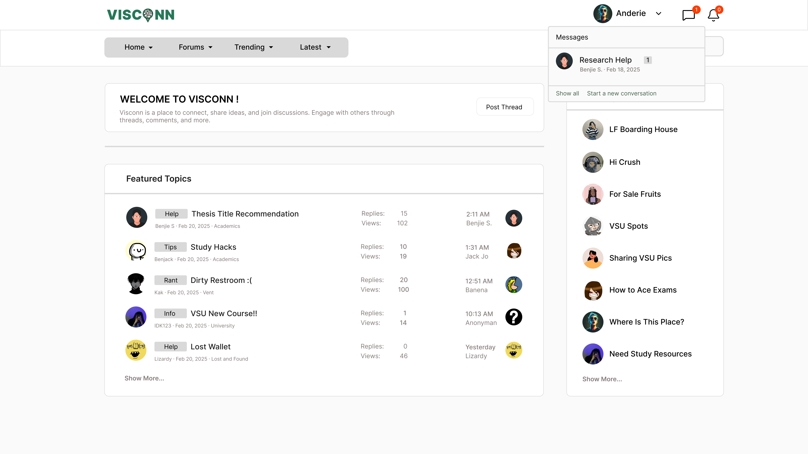
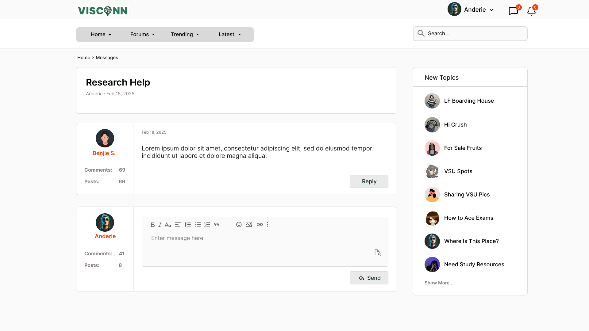

<h2>Purple-eclipse</h2>

<strong>Target:</strong> `AB.0XY.00Z`

<table border="1" cellpadding="0" cellspacing="0" style="width: 80%; font-size: 12px;">
    <tr style="width: 70%;">
        <td>
            <h3>Revisions</h3>
            <h4 style="list-style-type: none; padding-left: 0;">Site Map</h4>
            <a href="../homepage/homepage.md">Homepage</a>
             
            <a href="../authenticate-user/account-signup.md">Authentication</a>
            <ul>
                <li><a href="../authenticate-user/account-signup.md">Sign up</a></li>
                <li><a href="../authenticate-user/account-login.md">Account Login</a></li>
            </ul>
            <a href="delete-comment.md">Forum Management</a>
            <ul>
                <li><a href="../manage-comment/delete-comment.md">Delete comment dialog</a></li>
                <li><a href="../manage-comment/edit-comment.md">Edit comment dialog</a></li>
                <li><a href="../manage-comment/post-comment.md">Post comment dialog</a></li>
            </ul>
            <a href="../manage-forum/add-forum.md">Discussion Creation/Participation</a>
            <ul>
                <li><a href="../manage-forumadd-forum.md">Add forum dialog</a></li>
                <li><a href="../manage-forum/add-subforum.md">Add subforum dialog</a></li>
                <li><a href="../manage-forum/delete-forum.md">Delete forum dialog</a></li>
                <li><a href="../manage-forum/delete-subforum.md">Delete subforum dialog</a></li>
                <li><a href="../manage-forum/edit-forum.md">Edit forum dialog</a></li>
                <li><a href="../manage-forum/edit-subforum.md">Edit subforum dialog</a></li>
            </ul>
            <a href="../manage-notification/receive-notification.md">Notification</a>
            <ul>
                <li><a href="../manage-notification/receive-notification.md">Receive notification dialog</a></li>
            </ul>
            <a href="../manage-thread/delete-thread.md">Multimedia Content Sharing</a>
            <ul>
                <li><a href="../manage-thread/delete-thread.md">Delete thread dialog</a></li>
                <li><a href="../manage-thread/edit-thread.md">Edit thread dialog</a></li>
                <li><a href="../manage-thread/manage-thread.md">Manage thread dialog</a></li>
                <li><a href="../manage-thread/view-thread.md">View thread dialog</a></li>
            </ul>
            <a href="">Search Functionality</a>
              
            <a href="receive-message.md">Real-Time Messaging</a>
            <ul>
                <li><a href="receive-message.md">Receive message</a></li>
                <li><a href="send-message.md">Send message</a></li>
            </ul>
        </td>
        <td valign="top" style="width: 30%;">
            <a href="https://github.com/Davidty143/purple-eclipse/blob/main/docs/homepage/homepage.md">Homepage</a> &gt;
            <a href="https://github.com/Davidty143/purple-eclipse/tree/main/docs/manage-forum">Receive Message</a>
              
             
            
            <h2>Receive Message</h2>
            
The "Receive Message" functionality allows users to view incoming messages from other users. This feature ensures users are notified about new messages, and can read, reply, or manage their message threads within the messaging platform.
            

            <h2>Use Case Scenario</h2>
            <table border="1">
                <tr>
                    <td colspan="2" align="left">
                      User Receive Message
                    </td>
                </tr>
                <tr>
                    <th>Actor(s)</th>
                    <td>User, System</td>
                </tr>
              <tr>
                <th>Goal</th>
                <td>Allow users to receive and read new messages sent by other users within the platform.</td>
              </tr>  
                <tr>
                    <th>Precondtions</th>
                    <td>
                         The user is logged in to their account. 
                         The sender must be a registered user on the platform.
                    </td>
                </tr>
                <tr>
                    <th>Main Scenario</th>
                    <td>
                        1.The user clicks on the message icon in the header, navigates to the messaging section of the platform, or through the notification. 
                        2. The system loads the user's inbox, which displays a list of message threads (each containing the sender’s name, subject, and recent messages). 
                        3. If the user clicks on a message thread, the system displays the full thread, including the subject, sender, and all previous messages in the thread. 
                        4. The user may reply to the message, or delete the message they’ve sent.
                                     
                    </td>
                </tr>
                <tr>
                    <th>Outcome: </th>
                    <td>
                      The user successfully receives and views new messages in their inbox. The system updates the inbox with the new messages, allowing the user to interact with them (reply and delete).
                    </td>
                </tr>
            </table>   
          <tr>
              <td colspan="2" align="center">
                  © Tenza
              </td>
          </tr>
</table>

