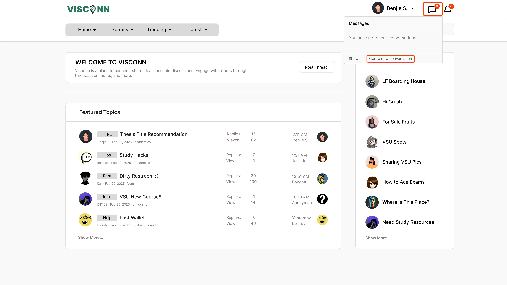
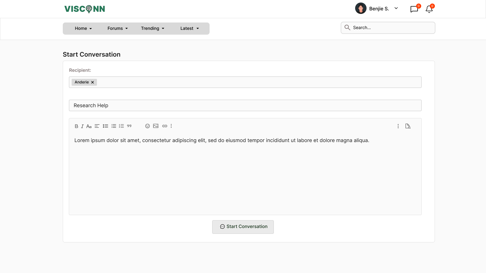
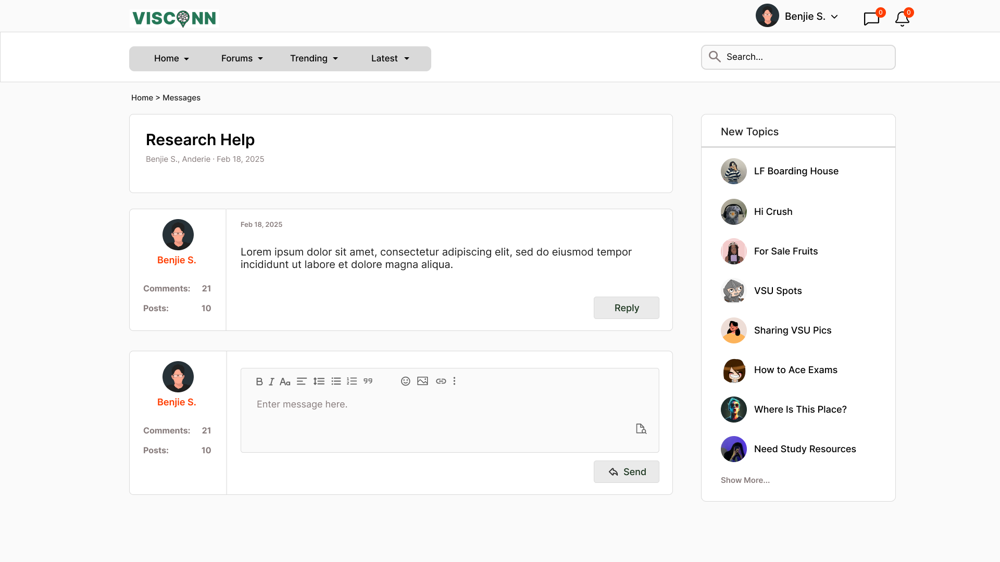

<h2>Purple-eclipse</h2>

<strong>Target:</strong> `PE.010.006`

<table border="1" cellpadding="0" cellspacing="0" style="width: 80%; font-size: 12px;">
    <tr style="width: 70%;">
        <td valign="top">
            <h3 style="margin-top:0">Revisions</h3>
            <h4 style="list-style-type: none; padding-left: 0;">Site Map</h4>
            
 Main page, Authentication, and Account Creation 

            <a href="../homepage">Main Page</a>
            <ul style="list-style-type: none ; padding-left: 0">
                <li style="padding-left: 15px"> <a href="../homepage/homepage.md"> Home Page </a></li>  
            </ul>
            <a href="/authenticate-user">Authentication</a>
            <ul>
                <li><a href="../authenticate-user/account-signup.md">Sign up</a></li>
                <li><a href="../authenticate-user/account-login.md">Account Login</a></li>
            </ul>
             
 Forum Management 

            <a href="../manage-forum">Manage Forum</a>
            <ul>
                <li><a href="../manage-forum/add-forum.md">Add forum</a></li>
                <li><a href="../manage-forum/add-subforum.md">Add subforum</a></li>
                <li><a href="../manage-forum/delete-forum.md">Delete forum</a></li>
                <li><a href="../manage-forum/delete-subforum.md">Delete subforum</a></li>
                <li><a href="../manage-forum/edit-forum.md">Edit forum</a></li>
                <li><a href="../manage-forum/edit-subforum.md">Edit subforum</a></li>
                <li><a href="../manage-forum/view-forum.md">View forum</a></li>
                <li><a href="../manage-forum/view-subforum.md">View subforum</a></li>
            </ul>
            <a href="../manage-thread">Manage Thread</a>
            <ul>
                <li><a href="../manage-thread/delete-thread.md">Delete thread</a></li>
                <li><a href="../manage-thread/edit-thread.md">Edit thread</a></li>
                <li><a href="../manage-thread/manage-thread.md">Manage thread</a></li>
                <li><a href="../manage-thread/view-thread.md">View thread</a></li>
            </ul>
            
 Forum and subforum browsing and joining, Multimedia Content Sharing

            <a href="/manage-comment">Manage Comment</a>
            <ul>
                <li><a href="../manage-comment/delete-comment.md">Delete comment</a></li>
                <li><a href="../manage-comment/edit-comment.md">Edit comment</a></li>
                <li><a href="../manage-comment/post-comment.md">Post comment</a></li>
            </ul>
            
 Notification System 

            <a href="../manage-notification">Notification</a>
            <ul style="list-style-type: none ; padding-left: 0">
                <li style="padding-left: 15px"> <a href="../manage-notification/recieve-notification.md">Recieve notification </a></li>
                <li style="padding-left: 15px"> <a href="../manage-notification/delete-notification.md"> Delete comment </a></li>    
            </ul>
            
 Search Feature 
 
            <a href="../search-functionality">Search Functionality</a>
            <ul style="list-style-type: none ; padding-left: 0">
                <li style="padding-left: 15px"> <a href="../search-functionality/search-thread.md"> Search Thread </a></li>
                <li style="padding-left: 15px"> <a href="../search-functionality/search-user.md"> Search User </a></li>
            </ul>
            
 Manage Profile

            <a href="../manage-profile">Profile</a>
            <ul>
                <li><a href="../manage-profile/edit-profile.md">Edit Profile</a></li>
                <li><a href="../manage-profile/view-profile.md">View Profile</a></li>
            </ul>
            <h4> In-App Message </h4>
            <a href="/manage-message">Real-Time Messaging</a>
            <ul style="list-style-type: none ; padding-left: 0">
                <li style="padding-left: 15px"> <a href="send-message.md"> Send message </a></li>
                <li style="padding-left: 15px"> <a href="receive-message.md"> Receive message </a></li>
            </ul>
        </td>
        <td valign="top" style="width: 30%;">
            <a href="https://github.com/Davidty143/purple-eclipse/blob/main/docs/homepage/homepage.md">Homepage</a> &gt;
            <a href="https://github.com/Davidty143/purple-eclipse/tree/main/docs/manage-forum">Send Message</a>
              
             
             
            
            <h2>Send Message</h2>
            
The "Send Message" feature allows users to send direct messages in the form of threads, enabling users to communicate  with others in an organized manner. A user can send multiple messages in a thread, or continue an existing conversation with a recipient.
            

            <h2>Use Case Scenario</h2>
            <table border="1">
                <tr>
                    <td colspan="2" align="left">
                      User Send Messages
                    </td>
                </tr>
                <tr>
                    <th>Actor(s)</th>
                    <td>User, System</td>
                </tr>
              <tr>
                <th>Goal</th>
                <td>Allow users to send direct messages to other users.</td>
              </tr>  
                <tr>
                    <th>Precondtions</th>
                    <td>
                          The user is logged in to their account. 
                          The recipient must be a registered user on the platform.
                    </td>
                </tr>
                <tr>
                    <th>Main Scenario</th>
                    <td>
                        1. The user navigates to the messaging section, either from the main dashboard or by clicking the message  icon located in the header menu. 
                        2. The system displays the user's recent message threads along with a "Send a Direct Message" button. 
                        3. For a New Thread (New Recipient): &nbsp&nbsp&nbsp
                            a. The user clicks on the "Send a Direct Message" button to start a new message thread. &nbsp&nbsp&nbsp
                            b. A form appears containing the following fields: &nbsp&nbsp&nbsp&nbsp&nbsp&nbsp
                                - Recipient: The user enters the username or email of the recipient. &nbsp&nbsp&nbsp&nbsp&nbsp&nbsp
                                - Subject: The user enters the subject for the message (optional, depending on system settings). &nbsp&nbsp&nbsp&nbsp&nbsp&nbsp
                                - Message: The user types the content of the message. 
                        4. For an Existing Thread (Continuing a Conversation): &nbsp&nbsp&nbsp
                            a. If the user clicks on a previously sent message thread, the system loads that thread. &nbsp&nbsp&nbsp
                            b. The message form now only contains the option to type and send a new message within that thread, &nbsp&nbsp&nbsp
                            showing the history of the conversation (previous messages). 
                        5. The user clicks on the "Send" button. 
                        6. The system confirms that the message has been sent successfully.
                                     
                    </td>
                </tr>
                <tr>
                    <th>Outcome: </th>
                    <td>
                      The message is sent successfully. If it’s a new thread, it appears as a new message thread in both the sender's and  recipient's inboxes. If it’s a continuation of an existing message thread, the message is added to the ongoing conversation.
                    </td>
                </tr>
            </table>   
          <tr>
              <td colspan="2" align="center">
                  © Tenza
              </td>
          </tr>
</table>

