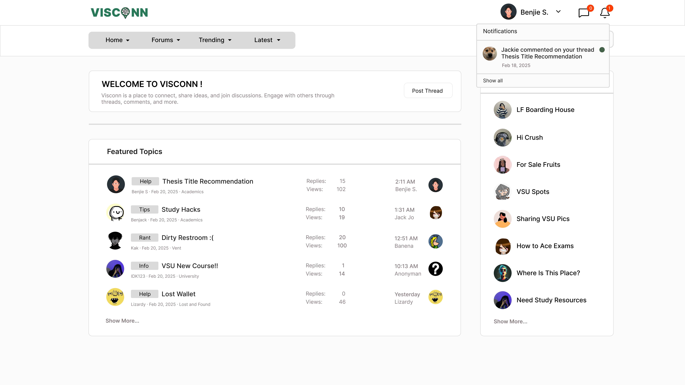

<h2>Purple-eclipse</h2>

<strong>Target:</strong> `PE.020.002`

<table border="1" cellpadding="0" cellspacing="0" style="width: 80%; font-size: 12px;">
    <tr style="width: 70%;">
        <td valign="top">
            <h3 style="margin-top:0">Revisions</h3>
            <h4 style="list-style-type: none; padding-left: 0;">Site Map</h4>
            
 Main page, Authentication, and Account Creation 

            <a href="/homepage">Main Page</a>
            <ul style="list-style-type: none ; padding-left: 0">
                <li style="padding-left: 15px"> <a href="../homepage/homepage.md"> Home Page </a></li>  
            </ul>
            <a href="/authenticate-user">Authentication</a>
            <ul>
                <li><a href="../authenticate-user/account-signup.md">Sign up</a></li>
                <li><a href="../authenticate-user/account-login.md">Account Login</a></li>
            </ul>
             
 Forum Management 

            <a href="../manage-forum">Manage Forum</a>
            <ul>
                <li><a href="../manage-forum/add-forum.md">Add forum</a></li>
                <li><a href="../manage-forum/add-subforum.md">Add subforum</a></li>
                <li><a href="../manage-forum/delete-forum.md">Delete forum</a></li>
                <li><a href="../manage-forum/delete-subforum.md">Delete subforum</a></li>
                <li><a href="../manage-forum/edit-forum.md">Edit forum</a></li>
                <li><a href="../manage-forum/edit-subforum.md">Edit subforum</a></li>
            </ul>
            <a href="../manage-thread">Manage Thread</a>
            <ul>
                <li><a href="../manage-thread/delete-thread.md">Delete thread</a></li>
                <li><a href="../manage-thread/edit-thread.md">Edit thread</a></li>
                <li><a href="../manage-thread/manage-thread.md">Manage thread</a></li>
                <li><a href="../manage-thread/view-thread.md">View thread</a></li>
            </ul>
            
 Forum and subforum browsing and joining, Multimedia Content Sharing

            <a href="../manage-comment">Manage Comment</a>
            <ul>
                <li><a href="../manage-comment/delete-comment.md">Delete comment</a></li>
                <li><a href="../manage-comment/edit-comment.md">Edit comment</a></li>
                <li><a href="../manage-comment/post-comment.md">Post comment</a></li>
            </ul>
            
 Notification Feature 

            <a href="../manage-notification">Notification</a>
            <ul style="list-style-type: none ; padding-left: 0">
                <li style="padding-left: 15px"> <a href="recieve-notification.md">Recieve notification </a></li>
                <li style="padding-left: 15px"> <a href="delete-notification.md"> Delete notification </a></li>    
            </ul>
            
 Search Feature 
 
            <a href="../search-functionality">Search Functionality</a>
            <ul style="list-style-type: none ; padding-left: 0">
                <li style="padding-left: 15px"> <a href="search-thread.md"> Search Thread </a></li>
                <li style="padding-left: 15px"> <a href="search-user.md"> Search User </a></li>
            </ul>
            
 Manage Profile 

            <a href="../manage-profile">Profile</a>
            <ul>
                <li><a href="../manage-profile/edit-profile.md">Edit Profile</a></li>
                <li><a href="../manage-profile/view-profile.md">View Profile</a></li>
            </ul>
            <h4> In-App Message </h4>
            <a href="../manage-message">Real-Time Messaging</a>
            <ul style="list-style-type: none ; padding-left: 0">
                <li style="padding-left: 15px"> <a href="../manage-message/send-message.md"> Send message </a></li>
                <li style="padding-left: 15px"> <a href="../manage-message/receive-message.md"> Receive message </a></li>
            </ul>
            
 Manage User 

            <a href="../manage-user">Manage User</a>
            <ul style="list-style-type: none ; padding-left: 0">
                <li style="padding-left: 15px"> <a href="../manage-user/ban-user.md"> Ban User </a></li>
                <li style="padding-left: 15px"> <a href="../manage-user/restrict-user.md"> Restrict User </a></li>
            </ul>
        </td>
        <td valign="top" style="width: 30%;">
            <a href="https://github.com/Davidty143/purple-eclipse/blob/main/docs/homepage/homepage.md">Homepage</a> &gt;
            <a href="https://github.com/Davidty143/purple-eclipse/tree/main/docs/receive-notification">Receive Notification</a>
              
            
            
            <h2>Recieve Notification</h2>
            
The "Receive Notifications" feature ensures that users stay informed about important activities or updates within the  platform. This includes notifications for new replies to threads, new messages, updates to forums or subforums, and   other user activities relevant to the user's interests or interactions.
            

            <h2>Use Case Scenario</h2>
            <table border="1">
                <tr>
                    <td colspan="2" align="left">
                      User Receive Notification
                    </td>
                </tr>
                <tr>
                    <th>Actor(s)</th>
                    <td>User, System</td>
                </tr>
              <tr>
                <th>Goal</th>
                <td>Notify the user about activities or updates relevant to their interactions on the platform.</td>
              </tr>  
                <tr>
                    <th>Preconditions</th>
                    <td>
                          The user is logged in to their account. 
                          The system has updates or actions to notify the user about.
                    </td>
                </tr>
                <tr>
                    <th>Main Scenario</th>
                    <td>
                        1. When certain actions or events occur (e.g., a new comment is posted on a thread the user is participating in or  a direct message is received), the system triggers a notification. 
                        2. Notifications are shown to the user in their notification panel, usually accessible via the header menu. 
                        3. The user can click on a notification to be redirected to the corresponding content, such as a thread or message. 
                        4. If the user interacts with the notification, it may be marked as "read" in the notification panel.         
                    </td>
                </tr>
                <tr>
                    <th>Outcome: </th>
                    <td>
                      The user receives relevant notifications and is kept updated on actions or events of interest.
                    </td>
                </tr>
            </table>   
          <tr>
              <td colspan="2" align="center">
                  © Tenza
              </td>
          </tr>
</table>

