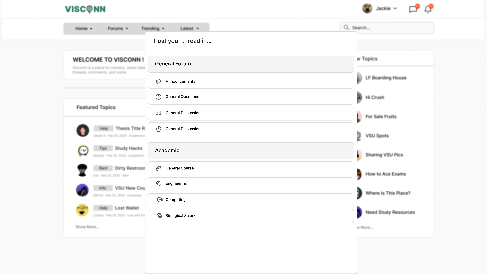
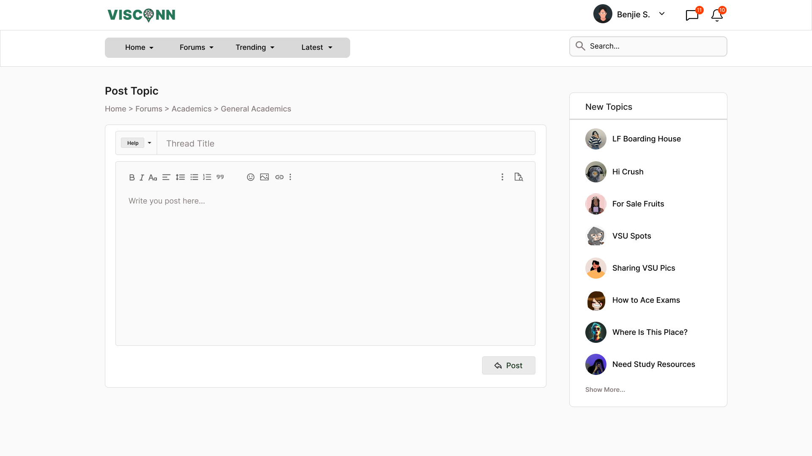
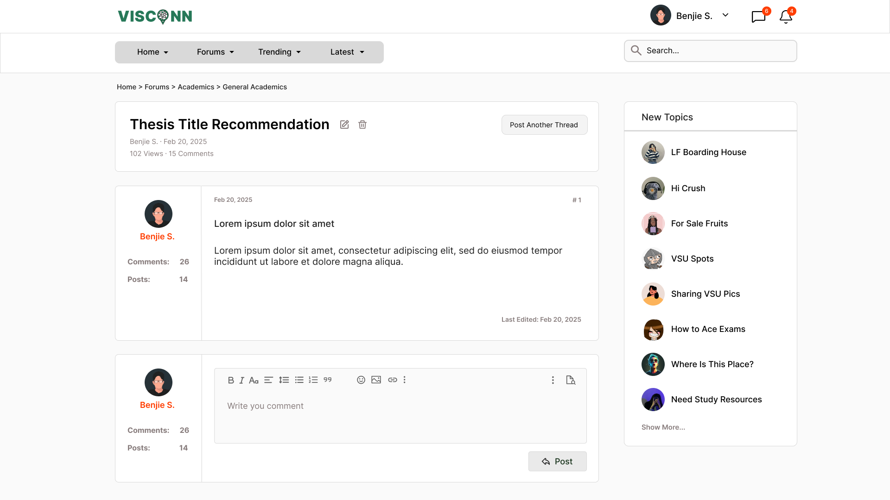

<h2>Purple-eclipse</h2>

<strong>Target:</strong> `PE.020.002`

<table border="1" cellpadding="0" cellspacing="0" style="width: 80%; font-size: 12px;">
    <tr style="width: 70%;">
        <td valign="top">
            <h3 style="margin-top:0">Revisions</h3>
            <h4 style="list-style-type: none; padding-left: 0;">Site Map</h4>
            
 Main page, Authentication, and Account Creation 

            <a href="../homepage">Main Page</a>
            <ul style="list-style-type: none ; padding-left: 0">
                <li style="padding-left: 15px"> <a href="../homepage/homepage.md"> Home Page </a></li>  
            </ul>
            <a href="/authenticate-user">Authentication</a>
            <ul>
                <li><a href="../authenticate-user/account-signup.md">Sign up</a></li>
                <li><a href="../authenticate-user/account-login.md">Account Login</a></li>
            </ul>
             
 Forum Management 

            <a href="../manage-forum">Manage Forum</a>
            <ul>
                <li><a href="../manage-forum/add-forum.md">Add forum</a></li>
                <li><a href="../manage-forum/add-subforum.md">Add subforum</a></li>
                <li><a href="../manage-forum/delete-forum.md">Delete forum</a></li>
                <li><a href="../manage-forum/delete-subforum.md">Delete subforum</a></li>
                <li><a href="../manage-forum/edit-forum.md">Edit forum</a></li>
                <li><a href="../manage-forum/edit-subforum.md">Edit subforum</a></li>
            </ul>
            <a href="/manage-thread">Manage Thread</a>
            <ul>
                <li><a href="delete-thread.md">Delete thread</a></li>
                <li><a href="edit-thread.md">Edit thread</a></li>
                <li><a href="manage-thread.md">Manage thread</a></li>
                <li><a href="view-thread.md">View thread</a></li>
            </ul>
            
 Forum and subforum browsing and joining, Multimedia Content Sharing

            <a href="../manage-comment">Manage Comment</a>
            <ul>
                <li><a href="../manage-comment/delete-comment.md">Delete comment</a></li>
                <li><a href="../manage-comment/edit-comment.md">Edit comment</a></li>
                <li><a href="../manage-comment/post-comment.md">Post comment</a></li>
            </ul>
            
 Notification System 

            <a href="../manage-notification">Notification</a>
            <ul style="list-style-type: none ; padding-left: 0">
                <li style="padding-left: 15px"> <a href="../manage-notification/recieve-notification.md">Recieve notification </a></li>
                <li style="padding-left: 15px"> <a href="../manage-notification/delete-notification.md"> Delete comment </a></li>    
            </ul>
            
 Search Feature 
 
            <a href="../search-functionality">Search Functionality</a>
            <ul style="list-style-type: none ; padding-left: 0">
                <li style="padding-left: 15px"> <a href="../search-functionality/search-thread.md"> Search Thread </a></li>
                <li style="padding-left: 15px"> <a href="../search-functionality/search-user.md"> Search User </a></li>
            </ul>
            
 Manage Profile

            <a href="../manage-profile">Profile</a>
            <ul>
                <li><a href="../manage-profile/edit-profile.md">Edit Profile</a></li>
                <li><a href="../manage-profile/view-profile.md">View Profile</a></li>
            </ul>
            <h4> In-App Message </h4>
            <a href="../manage-message">Real-Time Messaging</a>
            <ul style="list-style-type: none ; padding-left: 0">
                <li style="padding-left: 15px"> <a href="../manage-message/send-message.md"> Send message </a></li>
                <li style="padding-left: 15px"> <a href="../manage-message/receive-message.md"> Receive message </a></li>
            </ul>
            
 Manage User 

            <a href="../manage-user">Manage User</a>
            <ul style="list-style-type: none ; padding-left: 0">
                <li style="padding-left: 15px"> <a href="../manage-user/ban-user.md"> Ban User </a></li>
                <li style="padding-left: 15px"> <a href="../manage-user/restrict-user.md"> Restrict User </a></li>
            </ul>
        </td>
        <td valign="top" style="width: 30%;">
            <a href="https://github.com/Davidty143/purple-eclipse/blob/main/docs/homepage/homepage.md">Homepage</a> &gt;
            <a href="https://github.com/Davidty143/purple-eclipse/tree/main/docs/manage-thread">Add Thread</a>
              
            
            
            
            
            <h2>Add Thread</h2>
            
The "Post Thread" feature enables users to contribute new content to forums and subforums, enhancing community engagement.
              It ensures only authenticated users can create threads and enforces the completion of necessary fields to ensure the quality and usability of the threads posted.
           

            <h2>Use Case Scenario</h2>
            <table border="1">
                <tr>
                    <td colspan="2" align="left">
                     User Posts Thread
                    </td>
                </tr>
                <tr>
                    <th>Actor(s)</th>
                    <td>User, Admin</td>
                </tr>
              <tr>
                <th>Goal</th>
                <td>To create a post and thread in a selected subforum.
              </td>
              </tr>  
                <tr>
                    <th>Precondtions</th>
                    <td>
                          The user must be logged in to their account.
                    </td>
                </tr>
                <tr>
                    <th>Main Scenario</th>
                    <td>
                        1. The user navigates to the home page or the desired subforum.
                         
                        2. The user clicks on the "Create Thread" button.
                         
                        3. A form appears with fields for the thread title, tags, and content.
                         
                        4. The user enters a valid title, tags, and content for the thread.
                         
                        5. The user clicks on the "Post Thread" button to submit.
                                     
                        6. The thread is successfully posted and appears in the subforum.
                    </td>
                </tr>
                <tr>
                    <th>Outcome: </th>
                    <td>The user successfully posts a new thread, and it appears in the appropriate subforum.
                </td>
                </tr>
            </table>   
          <tr>
              <td colspan="2" align="center">
                  © Tenza
              </td>
          </tr>
</table>
